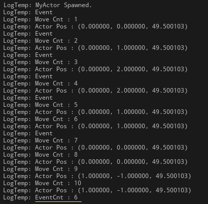

# 액터 랜덤 이동 구현

### 📌필수 구현 기능

**🔻요구 사항**

```
1.  시작점은 (0,0)이고 한번 이동시 x좌표와 y좌표 모두 2이상 이동할 수 없습니다.
    예를 들면 아래와 같습니다.
    - (0,0) 에서 (1,2)은 이동할수 없습니다. (y좌표 2이상 이동)
	- (0,0)에서 (1,1)은 이동할 수 있습니다. (x좌표 y좌표 모두 2미만 이동)
2.  이동은 입력을 받는게 아니고 10회 모두 랜덤으로 움직입니다.
3.  매번 이동시 현재 좌표를 출력할 수 있어야 합니다.
4.  로그 출력은 UE_LOG를 활용합니다.
5.  step 함수는 x좌표 y좌표 각각 이동할 거리 입니다. 
6.  move함수는 (0,0)부터 10회 움직이면서 좌표를 출력합니다. 
    이동시 step 함수가 활용 됩니다.
```

**🔻구현 결과**


### 📌도전 구현 기능

**🔻요구 사항**

```
1.  10회 이동시 각 스텝마다 이전 좌표기준 이동 거리를 계산해서 출력 합니다.
    이동 거리는 아래와 같이 계산 합니다.
2.  10회 이동시 각 스텝마다, 50% 확률로 랜덤하게 이벤트가 발생합니다.
    각  스텝마다 이벤트 발생여부를 출력합니다.
    (발생 시키는 부분도 구현하셔야 합니다.)
    
```

**🔻구현 결과**

