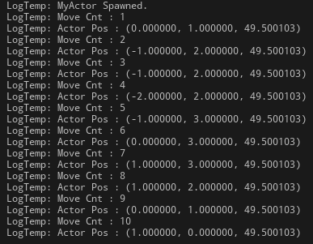
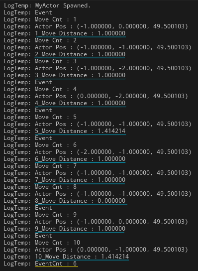

# 액터 랜덤 이동 구현

### 📌필수 구현 기능

**🔻요구 사항**

```
1.  시작점은 (0,0)이고 한번 이동시 x좌표와 y좌표 모두 2이상 이동할 수 없습니다.
    예를 들면 아래와 같습니다.
    - (0,0) 에서 (1,2)은 이동할수 없습니다. (y좌표 2이상 이동)
	- (0,0)에서 (1,1)은 이동할 수 있습니다. (x좌표 y좌표 모두 2미만 이동)
2.  이동은 입력을 받는게 아니고 10회 모두 랜덤으로 움직입니다.
3.  매번 이동시 현재 좌표를 출력할 수 있어야 합니다.
4.  로그 출력은 UE_LOG를 활용합니다.
5.  step 함수는 x좌표 y좌표 각각 이동할 거리 입니다. 
6.  move함수는 (0,0)부터 10회 움직이면서 좌표를 출력합니다. 
    이동시 step 함수가 활용 됩니다.
```

**🔻구현 결과**




---

### 📌도전 구현 기능

**🔻요구 사항**

```
1.  10회 이동시 각 스텝마다 이전 좌표기준 이동 거리를 계산해서 출력 합니다.
    이동 거리는 아래와 같이 계산 합니다.
2.  10회 이동시 각 스텝마다, 50% 확률로 랜덤하게 이벤트가 발생합니다.
    각  스텝마다 이벤트 발생여부를 출력합니다.
    (발생 시키는 부분도 구현하셔야 합니다.)
```

**🔻구현 결과**



---

### 📌코드

🔻헤더파일(MyActor.h)

[MyActor.h URL](https://github.com/Qussong/study_Sparta_Unreal-Num5/blob/main/ActorRandomMove/Source/ActorRandomMove/Public/Actors/MyActor.h)

```cpp
UCLASS()
class ACTORRANDOMMOVE_API AMyActor : public AActor
{
	GENERATED_BODY()
public:
	AMyActor();

protected:
	virtual void BeginPlay() override;

public:
	virtual void Tick(float DeltaTime) override;
	// Essential
	void Move();	// 액터 이동 수행 함수
	int32 Step();	// X,Y축 이동 거리 반환 함수
	// Challenge
	void MoveLength(FVector PrevPos, FVector NewPos);	// 액터 이동 거리 계산
	void Event();						// 이벤트 발생 함수
	
private:
	float Timer;
	int32 MoveCnt;
	int32 EventCnt;
};
```

🔻Cpp파일(MyActor.cpp)

[MyActor.cpp URL](https://github.com/Qussong/study_Sparta_Unreal-Num5/blob/main/ActorRandomMove/Source/ActorRandomMove/Private/Actors/MyActor.cpp)

```cpp
#include "Actors/MyActor.h"

AMyActor::AMyActor()
	: MoveCnt(0)
	  , Timer(0.f)
	  , EventCnt(0)
{
	PrimaryActorTick.bCanEverTick = true;
}

void AMyActor::BeginPlay()
{
	Super::BeginPlay();

	GEngine->AddOnScreenDebugMessage(-1, 2.f, FColor::Red, "MyActor Spawned.");
	UE_LOG(LogTemp, Log, TEXT("MyActor Spawned."));
}

void AMyActor::Tick(float DeltaTime)
{
	Super::Tick(DeltaTime);

	if (MoveCnt < 10)
	{
		if (Timer < 1.f)
		{
			Timer += DeltaTime;
		}
		else
		{
			Move();
			Timer = 0.f;
		}
	}
}

void AMyActor::Move()
{
	int Scale = 100.f;

	int DeltaX = Step() * Scale;
	int DeltaY = Step() * Scale;
	int DirectionX = FMath::RandBool() ? 1 : (-1);
	int DirectionY = FMath::RandBool() ? 1 : (-1);

	FVector PrevPos = GetActorLocation();
	float NewPosX = (DeltaX * DirectionX) + PrevPos.X;
	float NewPosY = (DeltaY * DirectionY) + PrevPos.Y;
	FVector NewPos = FVector(NewPosX, NewPosY, PrevPos.Z);
	SetActorLocation(NewPos);

	++MoveCnt;

	Event();
	
	FString DebugMessage_MoveCnt = FString::Printf(TEXT("MoveCnt = %d"), MoveCnt);
	GEngine->AddOnScreenDebugMessage(-1, 2.f, FColor::Yellow, DebugMessage_MoveCnt);
	UE_LOG(LogTemp, Log, TEXT("Move Cnt : %d"), MoveCnt);

	FString DebugMessage_NewPos = FString::Printf(
		TEXT("Actor Pos : (%f, %f, %f)"), NewPosX / Scale, NewPosY / Scale, GetActorLocation().Z);
	GEngine->AddOnScreenDebugMessage(-1, 2.f, FColor::Yellow, DebugMessage_NewPos);
	UE_LOG(LogTemp, Log, TEXT("Actor Pos : (%f, %f, %f)"), NewPosX/Scale, NewPosY/Scale, GetActorLocation().Z);

	MoveLength(PrevPos / Scale, NewPos / Scale);
	
	if (MoveCnt == 10)
	{
		UE_LOG(LogTemp, Log, TEXT("EventCnt : %d"), EventCnt);
	}
}

int32_t AMyActor::Step()
{
	bool bRandomBoolean = FMath::RandBool();
	return bRandomBoolean ? 1 : 0;
}

void AMyActor::MoveLength(FVector PrevPos, FVector NewPos)
{
	float MoveDistance = FMath::Sqrt(
		FMath::Pow(static_cast<float>(NewPos.X - PrevPos.X), 2.0f) +
		FMath::Pow(static_cast<float>(NewPos.Y - PrevPos.Y), 2.0f)
	);
	UE_LOG(LogTemp, Log, TEXT("%d_Move Distance : %f"), MoveCnt, MoveDistance);
}

void AMyActor::Event()
{
	bool bEvent = FMath::RandBool();
	if (bEvent)
	{
		UE_LOG(LogTemp, Log, TEXT("Event"));
		++EventCnt;
	}
}

```


